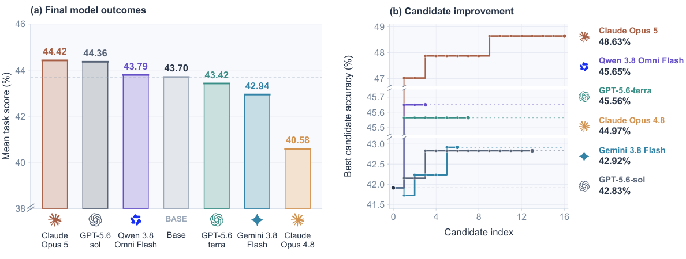

# MMPostTrainBench

**MMPostTrainBench: Benchmarking Autonomous Research for Multimodal Post-Training**

Can CLI agents improve multimodal models through autonomous post-training? MMPostTrainBench evaluates whether research agents can improve **Qwen3-Omni-30B-A3B** across audio, image, video, audiovisual, and multimodal coding tasks. An agent receives a base model, development feedback, and a GPU budget, then submits a `final_model` for evaluation on a held-out test set.

The benchmark measures data construction, training, experiment execution, and candidate selection.

## Main results



Figure 1 from the paper. Left: final model outcomes averaged across eight tasks, compared with the common base model. Right: best-so-far held-out candidate accuracy on MMMU-Pro; labels show the best candidate score.

## What's included

This repository provides the eight-task evaluation suite, training and verifier container recipes, configuration examples, and CPU regression tests.

Download model weights and datasets from their upstream providers. Some datasets, including OmniVideoBench, require access approval and a user-supplied Hugging Face token. See [NOTICE](NOTICE), [credential handling](docs/disclosure-security.md), and [validation](docs/validation.md).

## Benchmark tasks

| Task ID | Domain | Upstream Hugging Face dataset |
|---|---|---|
| `mmau` | Audio understanding | `lmms-lab-audio/mmau` |
| `mmar` | Audio reasoning | `ngqtrung/mmar` |
| `mmmu_pro` | Image understanding | `MMMU/MMMU_Pro` |
| `video_mmmu` | Video understanding | `lmms-eval/VideoMMMU` |
| `videomme_v2` | Video understanding | `MME-Benchmarks/Video-MME-v2` |
| `jointavbench` | Audiovisual understanding | `roverx12345/jointavbench` |
| `omnivideobench` | Audiovisual question answering | `NJU-LINK/OmniVideoBench` |
| `mmswe` | Multimodal coding | `SWE-bench/SWE-bench_Multimodal` |

The first seven tasks report multiple-choice accuracy; MMSWE reports the percentage of resolved instances.

## Architecture

```text
Agent container          Submitted model       Verifier container
(workspace + base model) --> final_model --> (read-only test data) --> reward.txt
                                                |
                                     Operator-side integrity audit
```

The agent and verifier run in separate containers. The agent has no shell access to held-out evaluation data or verifier code. The verifier uses read-only evaluation data, offline Hugging Face access, and the prepared evaluation scripts. Integrity auditing runs separately on the operator side.

The pipeline uses `docker run` and bind mounts on a GPU host. It does not require a particular cluster or scheduler. For queued or distributed execution, wrap `run_agent.sh` and `run_verifier.sh` with your scheduler.

## Quick start

### Requirements

- Linux, a working Docker daemon, and NVIDIA Container Toolkit.
- Network access to upstream models, datasets, and dependencies.
- Enough GPU memory for the model; the paper's full training configuration uses eight GPUs.
- Several hundred GB of storage for models, media, and caches.

See the [Docker setup guide](src/docker/README.md) for detailed configuration.

```bash
# 1. Install host-side download tools.
python3 -m pip install huggingface_hub pyarrow

# 2. Configure repository, model, data, cache, workspace, and log paths.
cp src/docker/config.env.example src/docker/config.env
# Edit config.env before proceeding. Store credentials outside the repository.

# 3. Generate verifier build contexts for all eight tasks.
python3 scripts/sync_eval_bundles.py
# One task:
# python3 src/harbor_adapter/run_adapter.py -b mmau -m qwen3-omni-30b -o harbor_tasks

# 4. Download upstream models and datasets.
bash src/docker/prepare_data.sh
# Selected tasks: bash src/docker/prepare_data.sh mmau mmar
# Generate local contamination references for the integrity audit:
python3 src/eval/build_contam_reference.py --out src/eval/contam_ref_all.jsonl

# 5. Prepare pinned harness dependencies and build containers.
python3 eval_omni/prepare_harnesses.py
python3 eval_omni/check_build_inputs.py
bash src/docker/build_images.sh

# 6. Evaluate a model with the isolated verifier.
BENCH=mmau bash src/docker/run_verifier.sh
# Outputs: $LOGS/verifier/metrics.json and reward.txt

# 7. Launch a research loop with the default 24-hour budget.
bash run_task.sh mmau claude-code <your-approved-model-id>
# Check only the base-model evaluation pipeline:
# bash run_task.sh mmau oracle
```

The research loop includes an operator-side integrity audit; incomplete audit checks require review before reporting scores. Keep evaluation references outside the agent workspace.

Set `FINAL_MODEL_SRC` to evaluate an existing model. Use a dedicated workspace for each run. Existing workspaces require `RESUME=1` or a new directory; `FRESH=1` explicitly resets dedicated run directories.

`BENCH=<id>` selects the matching verifier bundle. `run_task.sh` selects the same task bundle for both the agent and verifier.

## Repository structure

| Path | Contents |
|---|---|
| `src/` | Runtime launchers, task evaluators, bundle generation, and integrity checks |
| `train_omni/`, `eval_omni/` | Training and evaluation container recipes |
| `harbor_tasks/` | Generated bundles for the eight tasks |
| `tests/`, `docs/` | Regression tests and detailed setup documentation |

Detailed setup: [Docker guide](src/docker/README.md). Evaluation checks and runtime requirements: [validation](docs/validation.md).
